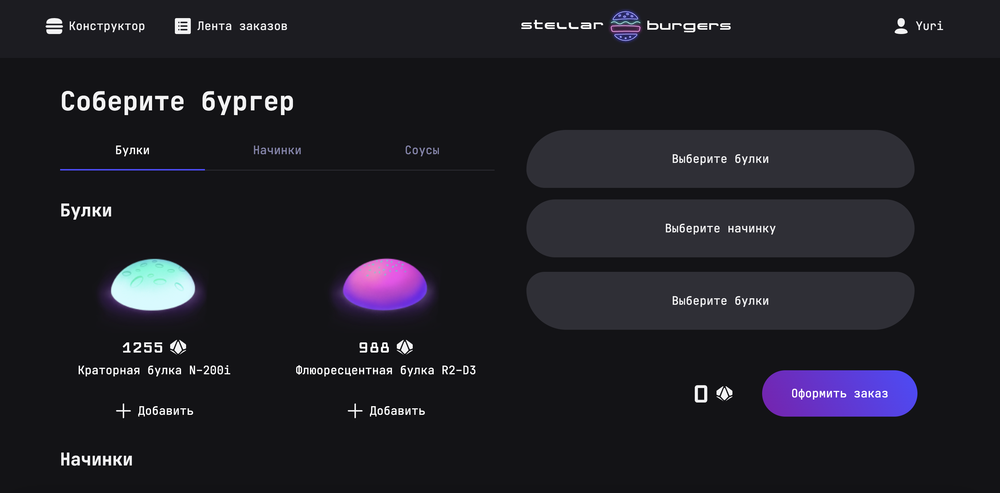

# Проектная работа 11-го спринта Stellar Burger

Космическая бургерная — React-приложение для заказа космических бургеров с возможностью сборки конструктора и отслеживания заказов в реальном времени.

[Макет](<https://www.figma.com/file/vIywAvqfkOIRWGOkfOnReY/React-Fullstack_-Проектные-задачи-(3-месяца)_external_link?type=design&node-id=0-1&mode=design>)

[Чеклист](https://www.notion.so/praktikum/0527c10b723d4873aa75686bad54b32e?pvs=4)

## Стек:

1. React
2. TypeScript
3. Redux
4. CSS
5. Webpack

